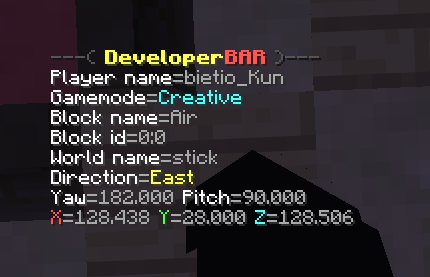

# DeveloperMode
> This project use [SmartCommand](https://github.com/RajadorDev/SmartCommand) framework

### Commands:
- **/developer** scoreboard <active: boolean> enable or disable scoreboard with infos.

### Scoreboard screenshot:

